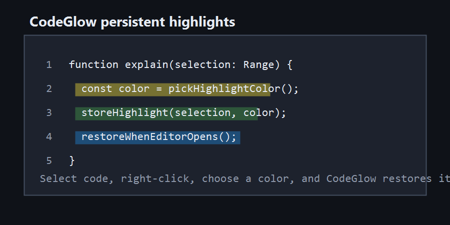

# CodeGlow

**Persistent code highlighting for learning, reviewing, and explaining code.**

CodeGlow brings document-style highlighting to Visual Studio Code. Select any code region, apply a color, and keep that visual context across sessions.

Whether you're studying a new language, reviewing unfamiliar code, or documenting important logic, CodeGlow helps preserve the connection between your explanations and the code they describe.

<<<<<<< HEAD

=======

  

>>>>>>> 993e10c (docs: polish README layout and switch to local asset paths)
---

## Why CodeGlow?

Comments explain code.

However, as files grow and time passes, it becomes harder to remember exactly which code region a comment was originally describing.

CodeGlow solves this by allowing you to **visually highlight** specific code regions and **persist those highlights** across editor restarts and workspace sessions.

Perfect for:

- 🎓 **Programming students** tracking execution paths
- 💻 **Self-taught developers** breaking down complex logic
- 🏫 **Technical educators** preparing walkthroughs
- 🔍 **Code reviewers** highlighting areas of concern

---

## Features

### 🖌️ Manual Code Highlighting

Select any code region and apply a highlight color instantly from the context menu. Available colors:

- 🟨 Yellow | 🟥 Red | 🟩 Green | 🟦 Blue

### 💾 Persistent Highlights

Highlights are automatically saved and restored when:

- VS Code restarts
- A workspace reopens
- A file is closed and reopened

### 📈 Intelligent Range Tracking

Highlights automatically adjust positions when lines are inserted or removed above the highlighted region, keeping your context aligned.

## Usage

### Create a Highlight

1. Select a code region.
2. Right-click inside the editor.
3. Choose **CodeGlow: Apply Highlight**.
4. Select a color.

### Remove a Highlight

1. Place the cursor inside a highlighted region.
2. Right-click inside the editor.
3. Choose **CodeGlow: Remove Highlight**.

### Change Highlight Color

1. Place the cursor inside a highlighted region.
2. Right-click inside the editor.
3. Choose **CodeGlow: Change Highlight Color**.
4. Select a new color.

---

## Commands

| Command                          | Command ID                 | Description                                         |
| -------------------------------- | -------------------------- | --------------------------------------------------- |
| CodeGlow: Apply Highlight        | `codeglow.highlight`       | Apply a highlight to the selected code region.      |
| CodeGlow: Remove Highlight       | `codeglow.removeHighlight` | Remove the highlight under the cursor.              |
| CodeGlow: Change Highlight Color | `codeglow.changeColor`     | Change the color of the highlight under the cursor. |

---

## Installation

### VS Code Marketplace

1. Open the Extensions view in VS Code.
2. Search for **CodeGlow**.
3. Click **Install**.

### Install from VSIX

1. Download or build the `.vsix` package.
2. Open the Command Palette.
3. Run **Extensions: Install from VSIX...**
4. Select the CodeGlow package.

> ⚠️ **Note on Line Tracking:** CodeGlow dynamically adjusts highlight ranges when code is added or removed _above_ your selections. Extensive modifications directly _inside_ a highlighted block may require reapplying the highlight.

---

## How Highlight Persistence Works

CodeGlow stores highlight information locally using VS Code workspace storage.

When code changes:

- Highlights move when lines are inserted above them.
- Highlights move when lines are removed above them.
- Highlights are removed if the highlighted code itself is deleted.

This keeps highlights aligned with the surrounding code as files evolve.

---

## Roadmap

Future improvements may include:

- Additional highlight colors
- Highlight export/import
- Workspace-level highlight management
- Improved range tracking

---

## License

MIT License
